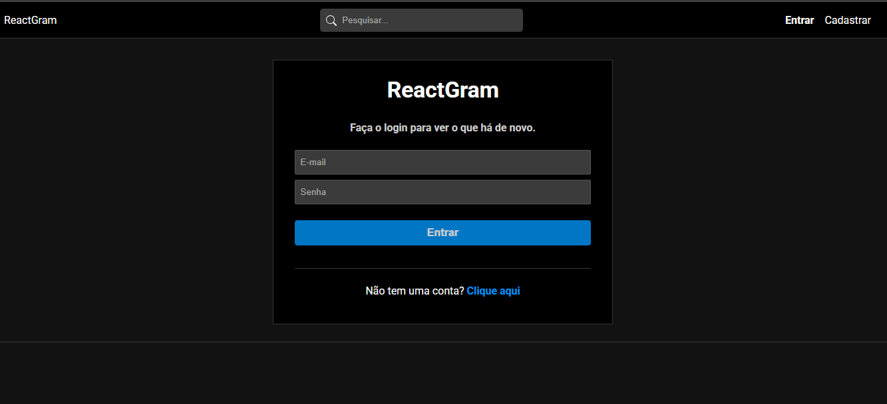
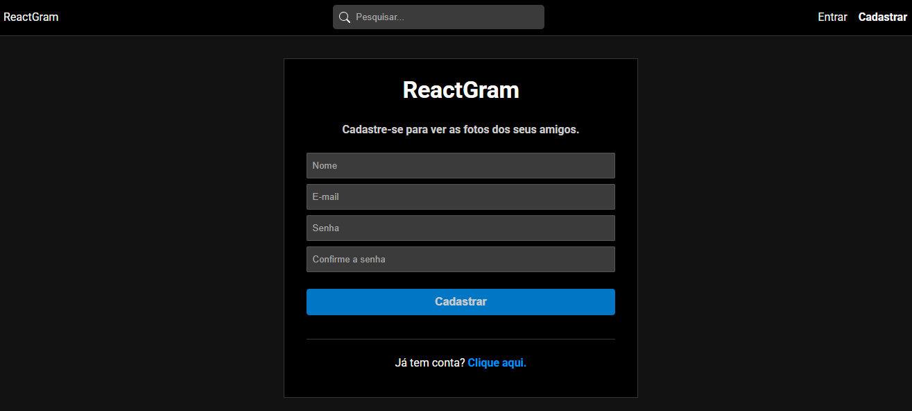
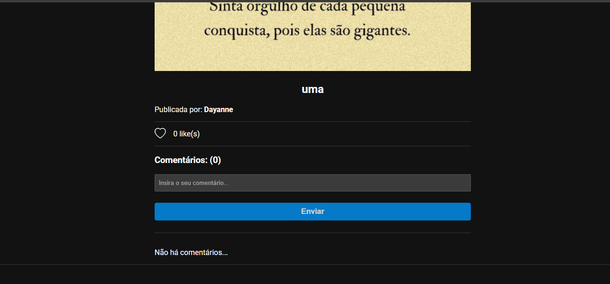
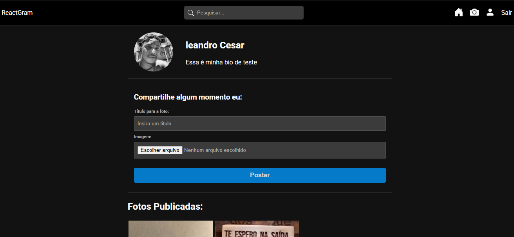

# react-gram-app
Aplicação com funcionalidades semelhantes ao instagram, postagem, likes e comentários, feito em react e node

- Home


##

- Registro


##

- Home 1


##

- Home 2


##

- Mais


##

- Publicar Foto


##

## Prerequisites

✔ - Node 18.19.1 +
✔ - MongoDB


## Quick Start

```
  
  - Rodar o comando para instalar as dependências na pasta principal do projeto front end: npm install

  - Rodar Projeto de front end via comando npm start

  - Rodar Projeto de back end via comando npm run server
  
```
